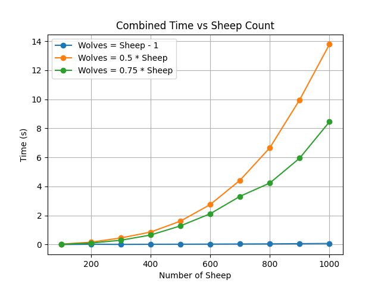

# Sheep and Wolves Agent
This repository provides a solution for the classic "Sheep and Wolves" problem. Using a Breadth-First Search (BFS) algorithm, the agent ensures the shortest solution is found efficiently. The project also includes scripts for testing the agent's performance and analyzing how its efficiency changes as the problem complexity increases.

---

## Problem Description

In the "Sheep and Wolves" problem, you are tasked with transporting sheep and wolves across a river using a boat, while adhering to the following constraints:

1. The boat can carry **a maximum of two animals** and must carry **at least one animal** per trip.
2. Wolves must **never outnumber sheep** on either side of the river unless there are no sheep present.

The objective is to find a valid sequence of moves to safely transport all the sheep and wolves from the left bank to the right bank of the river. The complexity of this problem increases with the number of sheep and wolves.

---

## Repository Contents

### 1. **`SemanticNetsAgent.py`**
- Contains the core `SemanticNetsAgent` class and the `solve()` function.
- Implements BFS to ensure optimal solutions for the problem.
- Key Features:
  - Systematically explores all valid states.
  - Validates moves to enforce constraints.
  - Efficiently detects unsolvable scenarios.

### 2. **`main.py`**
- A script for testing the agent on predefined test cases.
- Example: Solving the problem with **3 sheep and 3 wolves** outputs the optimal sequence of moves.

### 3. **`TestEfficiency.py`**
- A script for analyzing the performance of the agent.
- Features:
  - Tests the agent on three distinct sets of test cases:
    1. Wolves are nearly equal to sheep (\(n\) sheep, \(n-1\) wolves).
    2. Wolves are half the number of sheep (\(n\) sheep, \(0.5n\) wolves).
    3. Wolves are midway between Test Set 1 and Test Set 2 (\(n\) sheep, \(0.75n\) wolves).
  - Generates performance plots to compare execution times for different scenarios.
  - Saves results and plots in the `data/` directory.

---

## How the Agent Works

The `SemanticNetsAgent` solves the problem using the following approach:

1. **State Representation**:
   - Each state is represented as a tuple `(sheep_left, wolves_left, boat_position)`.
   - The numbers of animals on the right bank are calculated dynamically.

2. **Breadth-First Search (BFS)**:
   - The agent explores all possible states level-by-level, ensuring the shortest path is found.
   - States are added to a queue, and invalid states are discarded.

3. **State Validation**:
   - The agent enforces constraints, ensuring no state violates the rules:
     - Wolves must not outnumber sheep on either bank.
     - The number of animals on each bank must remain non-negative.
   - A visited set prevents redundant exploration of previously visited states.

4. **Solution**:
   - If the goal state `(0, 0, 1)` is reached, the agent outputs the sequence of moves.
   - If no valid sequence exists, it returns an empty list.

---

## Performance Analysis

The `TestEfficiency.py` script evaluates the agent's performance across varying scenarios:
1. **Solvable Cases**:
   - When a valid solution exists, the agent finds the optimal path, but execution time increases with the number of animals.
2. **Unsolvable Cases**:
   - When no solution exists (e.g., wolves outnumber sheep on both banks), the agent efficiently detects the lack of a solution.

### Example Performance Plot


---

## Example Usage

### 1. Solving the Problem
Run `main.py` to test predefined cases:
```bash
python main.py
